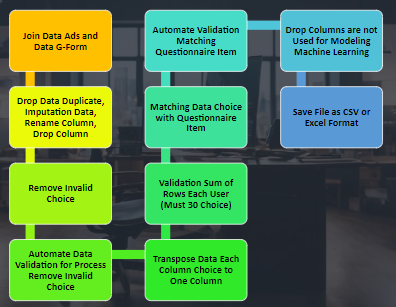
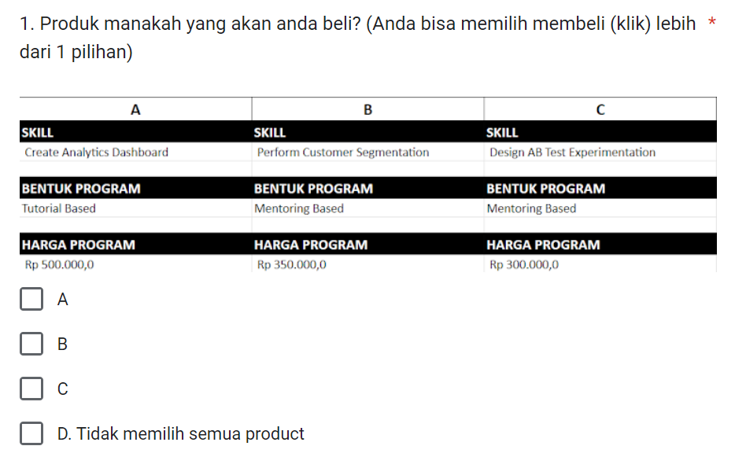

# Project: Class Launch Optimization

## Background Problem:
The educational company is currently experiencing a notable 15% decline in revenue over the last three months. In response to this challenge, the company is gearing up to launch a new class. The data team has been assigned the crucial task of recommending the most effective class type and pricing strategy to resonate with the market.

## Survey Overview:
To gain insights into the preferences and expectations of potential students, a comprehensive survey was conducted. The survey specifically focused on attributes such as class topics, teaching methods, and pricing.

## Conjont Analysis:
Utilizing Conjont Analysis, the data team dissected the survey data to comprehend how various attributes impact the choices of potential students. This model assists in identifying the most attractive combinations of class features.

## Objective:
The primary objective of this initiative is to provide recommendations for an optimal combination of class attributes and pricing. The ultimate goal is to achieve a substantial 30% increase in revenue within the next two months. The company aims to respond strategically to market changes, enhance competitiveness, and ensure that the new class not only aligns with customer preferences but also contributes significantly to both short-term and long-term financial growth.

</li><li> Data Cleaning and Wrangling FLow 
 

</li><li> Data Survey
 

# Revenue Growth Simulation and Recommendation Optimization

## Recommendation from Linear Regression:
- **Price:** Rp. 1,750,000
- **Form Product:** Applied
- **Skill:** Data Science

## Optimization Results:
- **Optimized Price:** Rp. 1,750,000
- **Optimized Revenue:** Rp. 29779.862425368792

## Revenue Growth Simulation for 3 Months

### Assumptions:
- Monthly Revenue: Rp. 100,000,000
- Target Growth Rate: 30%

### Simulation Results:
- Initial Monthly Revenue after 15% decline: Rp. 85,000,000
- Expected Monthly Revenue after 3 months: Rp. [Calculated Value]

### Evaluation:
- **Congrats:** Simulation achieves the target if the expected revenue after 3 months is greater than or equal to 130% of the initial monthly revenue.

**Note:** Adjust the calculated value based on your specific simulation results.
